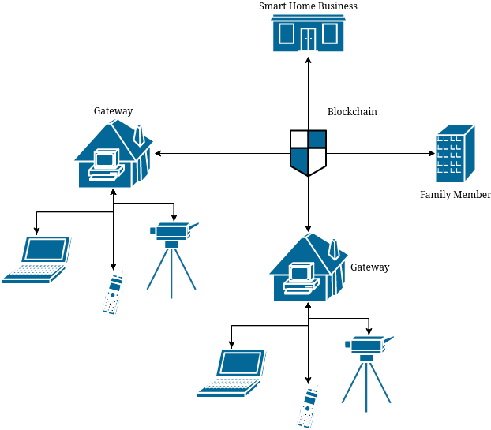

# A Blockchain-based Gateway for IoT Smart Home Solutions



## Stack
- [Hardhat](https://hardhat.org/)
- [Node.js](https://nodejs.org/en/)

## Smart Contract: [SmartHome](/contracts/SmartHome.sol)

### State Variables
- `address public gateway`
- `uint public thermostatTemperature`
- `bytes public garageCamera`
- `bool public bedroomLight`

### Functions
- `function setThermostatTemperature(uint tt) public`
- `function setGarageCamera(bytes memory gc) public`
- `function setBedroomLight(bool bl) public`

All functions have the requirement that only the creator of the contract can alter the variable state.

## API
- `GET /{address}/thermostatTemperature` - Retrieve thermosatTemperature variable value.
- `PUT /{address}/thermostatTemperature` - Update thermosatTemperature variable value.
    - `data=<uint>` - Required body parameter.
- `GET /{address}/garageCamera` - Retrieve garageCamera variable value.
- `PUT /{address}/garageCamera` - Update garageCamera variable value.
    - `data=<bytes>` - Required body parameter.
- `GET /{address}/bedroomLight` - Retrieve bedroomLight variable value.
- `PUT /{address}/bedroomLight` - Update bedroomLight variable value.
    - `data=<bool>` - Required body parameter.

## Installing
You need [npm](https://docs.npmjs.com/downloading-and-installing-node-js-and-npm) and [npx](https://www.npmjs.com/package/npx) to run the API and Hardhat scripts.
Then, install the necessary packages by running `npm install` in the root folder of the project.

## Running
After installing the modules, run `npx hardhat node` to start a local **Ethereum** node.

To deploy the SmartHome contract, run `npx hardhat run scripts/deploy-smarthome.ts --network localhost`. This will set the initial state of the `thermostatTemperature`, `garageCamera`, `bedroomLight` variables to 10, [] and false, respectively.

You should get an output similar to
```
SmartHome deployed to: 0x5FbDB2315678afecb367f032d93F642f64180aa3
```
Save the contract address to interact with it later.

Finally, run `npm run dev` to start the HTTP API, which will listen in port 3000.

## Usage
When you have your Ethereum node running, the SmartHome contract deployed and the API listening, you can start interacting with it by making HTTP requests to the API:

```
$ curl 127.0.0.1:3000/0x5FbDB2315678afecb367f032d93F642f64180aa3/thermostatTemperature
{"type":"BigNumber","hex":"0x0a"}
```

```
$ curl 127.0.0.1:3000/0x5FbDB2315678afecb367f032d93F642f64180aa3/thermostatTemperature -X PUT -d data=20
{"hash":"0xb49f0e0174d1f6d4e3bb871ca449814213e975826372024ab28f9727a47e719a","type":2,"accessList":[],"blockHash":"0xdc264995081774e938f3df9ded3312be9770f8501f14aa50ae7aace6cd51d721","blockNumber":2,"transactionIndex":0,"confirmations":1,"from":"0xf39Fd6e51aad88F6F4ce6aB8827279cffFb92266","gasPrice":{"type":"BigNumber","hex":"0x69683a83"},"maxPriorityFeePerGas":{"type":"BigNumber","hex":"0x3b9aca00"},"maxFeePerGas":{"type":"BigNumber","hex":"0x9735ab06"},"gasLimit":{"type":"BigNumber","hex":"0x7ef7"},"to":"0x5FbDB2315678afecb367f032d93F642f64180aa3","value":{"type":"BigNumber","hex":"0x00"},"nonce":1,"data":"0x48f144700000000000000000000000000000000000000000000000000000000000000014","r":"0xd7ddbb6d0f4ed493169df3ea35baf3af000b5baac087b51478412110d460fbee","s":"0x438b4539cacfb055c2862e2a605657da8ba451ab7284e70e35247cb6709ca272","v":0,"creates":null,"chainId":31337}
```

```
$ curl 127.0.0.1:3000/0x5FbDB2315678afecb367f032d93F642f64180aa3/garageCamera -X PUT -F "data=@./architecture.png"
{"hash":"0xcd5b35ecae63645fe10d22c68f2dfeaf9c3a56746196667492d3479a5515c94a","type":2,"accessList":[],"blockHash":"0x482cc52ac14badfa5acbe035e1af2b4a0f9d941bb82ed37d59fecef20ef80fe3","blockNumber":4,"transactionIndex":0,"confirmations":1,"from":"0xf39Fd6e51aad88F6F4ce6aB8827279cffFb92266","gasPrice":{"type":"BigNumber","hex":"0x65c04b90"},"maxPriorityFeePerGas":{"type":"BigNumber","hex":"0x3b9aca00"},"maxFeePerGas":{"type":"BigNumber","hex":"0x8fe5cd20"},"gasLimit":{"type":"BigNumber","hex":"0x271281"},"to":"0x5FbDB2315678afecb367f032d93F642f64180aa3","value":{"type":"BigNumber","hex":"0x00"},"nonce":3,"data":"0x2b69a5d0000000000...
27fe156e3873d896ba49420000000049454e44ae42608200000000000000000000","r":"0x313457cfd37829b15cb2f947b2f9e118f02892d9d8f3e7c003b01ff9f7c84988","s":"0x16fcb0f46a448bca090469dde0efe24d7e0b34f0e47a73c4389b946d81fdb14c","v":0,"creates":null,"chainId":31337}
```

```
$ curl 127.0.0.1:3000/0x5fbdb2315678afecb367f032d93f642f64180aa3/garageCamera | diff - ./architecture.png
```

```
$ curl 127.0.0.1:3000/0x5FbDB2315678afecb367f032d93F642f64180aa3/bedroomLight
false
```

```
$ curl 127.0.0.1:3000/0x5FbDB2315678afecb367f032d93F642f64180aa3/bedroomLight -X PUT -d 'data=true'
{"hash":"0x0b2e860812a0f8c2b034b71884b7f81fdf17f5ffe6691f654c899f5d7f2e597c","type":2,"accessList":[],"blockHash":"0x32bec85a22255c9b21888d23c1146fcf9cc6613118b14f1dbc6be0032ba67a9b","blockNumber":5,"transactionIndex":0,"confirmations":1,"from":"0xf39Fd6e51aad88F6F4ce6aB8827279cffFb92266","gasPrice":{"type":"BigNumber","hex":"0x6161d736"},"maxPriorityFeePerGas":{"type":"BigNumber","hex":"0x3b9aca00"},"maxFeePerGas":{"type":"BigNumber","hex":"0x8728e46c"},"gasLimit":{"type":"BigNumber","hex":"0xc293"},"to":"0x5FbDB2315678afecb367f032d93F642f64180aa3","value":{"type":"BigNumber","hex":"0x00"},"nonce":4,"data":"0x0e2cc97d0000000000000000000000000000000000000000000000000000000000000001","r":"0x6cb3914b99eb9fa50dc92fd1a44d9bdd37c5b86c11ba028bd4d4ecf294ad7e47","s":"0x2bdaaef30f905802d8a89a7239b1eb2454902ff04863062160e0c92180a46d99","v":1,"creates":null,"chainId":31337}
```
## Testing
You can test your contracts by running

```
npx hardhat test
```